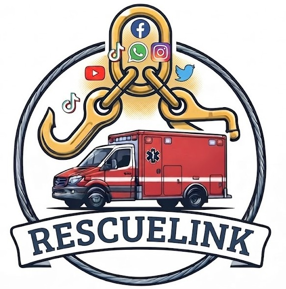

<div align="center">



# RescueLink AI

[](https://react.dev)
[](https://www.typescriptlang.org)
[](https://vitejs.dev)
[](https://supabase.com)
[](https://tailwindcss.com)
[](https://openai.com)
[](LICENSE)

**An AI-Powered Disaster Response, Relief Coordination, and Public Information Platform**

*Built for Local Government Units and NGOs in the Philippines*

</div>

---

## The Problem

During disasters, communication becomes fragmented. Citizens struggle to report emergencies, local governments receive duplicate or incomplete reports, donations are difficult to coordinate, and the public often lacks verified information. This delays rescue operations and slows relief distribution.

Existing tools are siloed — rescue teams use radio, citizens post on Facebook, donations come through bank transfers, and LGU dashboards are updated manually. There is no single system that connects all of these.

---

## The Solution

**RescueLink AI** centralizes disaster reporting, AI-assisted emergency response, humanitarian aid coordination, and public communication through familiar platforms like Facebook Messenger.

Instead of replacing existing communication channels, RescueLink AI **integrates with Facebook Messenger, Telegram, WhatsApp, and a web dashboard** — meeting citizens where they already are.

AI automates report classification, prioritization, donation matching, and public information dissemination while providing a real-time command dashboard for LGUs and NGOs.

---

## How It Works

```
Citizen reports via Messenger / Telegram / WhatsApp / Web
        ↓
AI extracts: disaster type · location · severity · people affected
        ↓
Incident ticket created → LGU dashboard notified in real-time
        ↓
Volunteers matched → Rescue team dispatched
        ↓
Citizen receives SMS/email status update
        ↓
Public dashboard updated → Community stays informed
```

---

## Key Features

| Feature | Description |
|---|---|
| **Multi-channel Intake** | Citizens report via Facebook Messenger, Telegram, WhatsApp, or the embedded web widget |
| **AI Extraction** | OpenAI extracts disaster type, location, severity, and people affected from raw messages |
| **Real-time Dashboard** | Live KPI cards, area/bar/pie charts, incident trend graphs, and a live activity feed |
| **Monitoring Map** | Google Maps with real-time clustered incident markers colored by severity |
| **Facebook Monitoring** | Sync FB page posts, flag AI-detected emergencies, reply via Messenger DMs |
| **Volunteer Management** | Track availability, skills, and equipment; auto-match volunteers to incidents |
| **Donations** | Accept and track monetary and in-kind donations via PayMongo |
| **Public Dashboard** | Geo-filtered public view with location detection and radius selector |
| **Embeddable Widget** | Drop-in chat bubble for any barangay website |
| **Role-based Access** | LGU, NGO, volunteer, and citizen roles |
| **SMS / Email Alerts** | Automated status updates to reporters via Semaphore and Resend |

---

## Tech Stack

| Layer | Technology |
|---|---|
| Frontend | React 19, TypeScript 6, Vite 8 |
| Styling | Tailwind CSS 4, Framer Motion |
| State | Redux Toolkit |
| Backend | Supabase (Postgres + Realtime + Auth + Edge Functions) |
| Maps | Google Maps via `@vis.gl/react-google-maps` + MarkerClusterer |
| Charts | Recharts |
| AI | OpenAI GPT (via Supabase Edge Functions) |
| Messaging | Facebook Messenger, Telegram Bot, WhatsApp Business API |
| Payments | PayMongo |
| Notifications | Semaphore SMS, Resend Email |

---

## Project Structure

```
src/
├── components/
│   ├── incidents/       # IncidentCard, IncidentMap, FbMonitorPanel, MonitoringMapClusters
│   ├── layout/lgu/      # LGUShell, LGUSidebar
│   ├── shared/          # Modal, LoadingSpinner, EmptyState, MotionWrappers
│   └── ui/              # Button, Input, Card
├── config/              # Nav items and role-based routing config
├── context/             # AuthContext, ModalContext
├── hooks/               # useIncidents, useDonations, useVolunteers, useFacebookPosts, useRealtime
├── pages/               # Dashboard, Incidents, MonitoringMap, FbMonitor, Donations, Volunteers, Login, PublicDashboard, Settings
├── redux/               # Store + slices (auth, incidents, donations)
├── routes/              # AppRouter, ProtectedRoute
├── services/            # Supabase client, auth, incidents, donations, facebook, volunteers
├── types/               # Incident, Donation, Volunteer, FbPost, User
└── widget/              # Embeddable citizen chat widget
supabase/
├── functions/           # Edge Functions (ai-extract, messenger-webhook, telegram-webhook, etc.)
└── migrations/          # SQL migrations
```

---

## Getting Started

### Prerequisites

- Node.js 18+
- pnpm (`npm install -g pnpm`)
- A [Supabase](https://supabase.com) project
- A [Google Maps](https://console.cloud.google.com) API key with Maps JavaScript API + Geocoding enabled
- (Optional) Facebook App, Telegram Bot, WhatsApp Business account

### 1. Clone the repo

```bash
git clone https://github.com/your-org/rescuelinkai.git
cd rescuelinkai
```

### 2. Install dependencies

```bash
pnpm install
```

### 3. Set up environment variables

```bash
cp .env.example .env
```

Fill in your `.env`:

```env
VITE_SUPABASE_URL=https://<project-ref>.supabase.co
VITE_SUPABASE_ANON_KEY=<anon-key>
VITE_GOOGLE_MAPS_API_KEY=<google-maps-api-key>
```

### 4. Run database migrations

```bash
pnpm supabase db push
```

Or apply the SQL files in `supabase/migrations/` manually via the Supabase dashboard.

### 5. Deploy Edge Functions

```bash
pnpm supabase functions deploy
```

Set backend secrets:

```bash
supabase secrets set --env-file .env
```

### 6. Start the dev server

```bash
pnpm dev
```

Open [http://localhost:5173](http://localhost:5173)

---

## Environment Variables

| Variable | Description |
|---|---|
| `VITE_SUPABASE_URL` | Your Supabase project URL |
| `VITE_SUPABASE_ANON_KEY` | Supabase anon/public key |
| `VITE_GOOGLE_MAPS_API_KEY` | Google Maps JavaScript API key |
| `SUPABASE_SERVICE_ROLE_KEY` | Service role key (Edge Functions only) |
| `OPENAI_API_KEY` | OpenAI key for AI extraction |
| `FB_PAGE_ACCESS_TOKEN` | Facebook Page access token |
| `FB_VERIFY_TOKEN` | Facebook webhook verify token |
| `TELEGRAM_BOT_TOKEN` | Telegram bot token |
| `WHATSAPP_TOKEN` | WhatsApp Business API token |
| `PAYMONGO_SECRET_KEY` | PayMongo secret key |
| `SMS_API_KEY` | Semaphore SMS API key |
| `RESEND_API_KEY` | Resend email API key |

See `.env.example` for the full list.

---

## Facebook OAuth (Login)

1. Create a Facebook App at [developers.facebook.com](https://developers.facebook.com)
2. Enable **Facebook** as an OAuth provider in your Supabase dashboard under **Authentication → Providers**
3. Add your Supabase callback URL to the Facebook App's Valid OAuth Redirect URIs:
   ```
   https://<project-ref>.supabase.co/auth/v1/callback
   ```
4. The login page opens Facebook auth in a centered popup window automatically.

---

## Supabase Edge Functions

| Function | Trigger | Description |
|---|---|---|
| `ai-extract` | DB insert | Extracts incident data from raw messages using OpenAI |
| `messenger-webhook` | HTTP POST | Receives Facebook Messenger messages |
| `telegram-webhook` | HTTP POST | Receives Telegram bot messages |
| `whatsapp-webhook` | HTTP POST | Receives WhatsApp messages |
| `match-volunteer` | Manual / DB | Matches available volunteers to incidents |
| `notify-citizen` | DB update | Sends SMS/email status updates to reporters |
| `process-donation` | HTTP POST | Handles PayMongo donation webhooks |
| `post-advisory` | Manual | Posts public advisories to Facebook page |
| `sync-fb-posts` | Cron | Syncs Facebook page posts for AI monitoring |
| `sync-messenger-history` | Manual | Backfills Messenger conversation history |

---

## Scripts

```bash
pnpm dev          # Start dev server
pnpm build        # Production build
pnpm build:widget # Build embeddable widget bundle
pnpm lint         # Run Oxlint
pnpm preview      # Preview production build
```

---

## Contributing

1. Fork the repo
2. Create a feature branch: `git checkout -b feat/your-feature`
3. Commit with a descriptive message
4. Open a pull request

---

## License

MIT © RescueLink AI — Philippines
